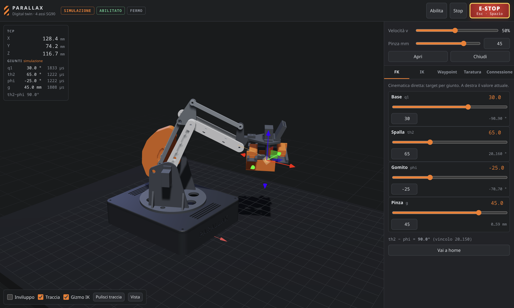
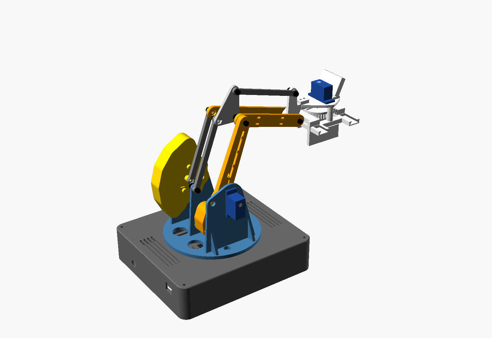

# Parallax Arm

Braccio robotico da scrivania a 4 assi, **solo servo SG90**, interamente stampabile in PLA, **zero saldature**.
Lo pilota un ESP32 e si controlla da una web app locale con digital twin 3D.



| | |
|---|---|
| Assi | base, spalla, gomito + pinza parallela; pinza **sempre orizzontale** (doppio parallelogramma) |
| Sbraccio | 188 mm dall'asse spalla (th2 − phi ≥ 35°) |
| Payload | 50 g anche con la ESP32-CAM montata (SF ≥ 2 sulla coppia di stallo: `calc/` + simulazione MuJoCo in `sim/`) |
| Pinza | cremagliera simmetrica, corsa 0–59 mm |
| Motori | 4 × SG90 180°: spalla e gomito sulla torretta, contrappesi con piombi da pesca |
| Elettronica | ESP32 DevKit V1, PWM diretto dai GPIO, caricatore USB 5V 3A, morsetti WAGO |
| Software | firmware PlatformIO (WebSocket, planner sincronizzato), web app Vite + Three.js (FK, IK, waypoint, taratura, simulazione) |



## Come è fatto

Un SG90 da 1.6 kg·cm non regge un braccio seriale.

**Il servo del gomito è sulla torretta**, accanto a quello della spalla, e muove l'avambraccio con una manovella e una biella. Così nessun motore viaggia sul braccio.

Due parallelogrammi passivi tengono la pinza orizzontale, e i piombi da pesca sulle code di manovella e braccio compensano la gravità a qualsiasi angolo.

Ogni numero si può rilanciare:
- `python3 calc/torque.py` per le coppie, con le masse ricavate dagli STL;
- `cad/assembly.scad` per le collisioni tra tutte le parti, viti e dadi compresi, su una griglia di pose.

## Struttura

```
calc/torque.py        coppie statiche, contrappesi, pinza, corrente (con assert)
cad/params.scad       unica fonte delle quote e delle tolleranze
cad/*.scad            base, torretta, braccio, manovella, catena gomito, polso+pinza, provino tolleranze
cad/assembly.scad     assieme + verifica collisioni
cad/export.sh         rigenera STL di stampa, modelli del twin e rig.json
cad/stl/              STL pronti, già orientati sul piatto
firmware/             ESP32 (PlatformIO): LEDC, WiFi STA/AP, WebSocket, NVS, test nativi
web/                  digital twin e controllo (Vite + Three.js), build -> firmware/data
docs/                 analisi, cablaggio, protocollo, stampa e montaggio
```

## Avvio rapido

1. Stampa gli STL di `cad/stl/` (circa 230 g di PLA, niente supporti) e monta: [docs/04-stampa-e-montaggio.md](docs/04-stampa-e-montaggio.md).
2. Il provino di tolleranze è facoltativo: serve solo se qualcosa non calza.
3. Cablaggio: [docs/02-cablaggio.md](docs/02-cablaggio.md).
4. Carica firmware e web app:
   ```bash
   cd web && npm install && npm run build
   cd ../firmware && pio run -e esp32dev -t upload && pio run -e esp32dev -t uploadfs
   ```
   Poi apri `http://braccio.local`, oppure l'AP `BRACCIO` su `http://192.168.4.1`.

Senza hardware: `cd web && npm install && npm run dev`. La web app gira in simulazione con lo stesso profilo di moto del firmware.

## Test

```bash
python3 calc/torque.py                    # punti di progetto delle coppie
cd firmware && pio test -e native         # planner, limiti, mappatura µs
cd web && npm test                        # FK/IK andata e ritorno, profilo di moto
cad/check_grid.sh                         # collisioni su tutta la griglia di pose (lento)
sim/software/run_all.sh                   # firmware = twin, fuzz, protocollo end-to-end, UI
python3 sim/structural/run_all.py         # strutture, perni, ingranaggi, tolleranze (Monte Carlo)
python3 sim/electrical/run_all.py         # alimentazione nel tempo
sim/.venv/bin/python sim/dynamics/run_all.py   # dinamica MuJoCo (python3 -m venv sim/.venv && sim/.venv/bin/pip install mujoco numpy scipy matplotlib)
```

Esiti e limiti: [docs/05-verifiche.md](docs/05-verifiche.md).

## Documenti

- [01 — Analisi carichi e scelte di progetto](docs/01-analisi-e-piano.md)
- [02 — Cablaggio senza saldature](docs/02-cablaggio.md)
- [03 — Cinematica, taratura e protocollo](docs/03-protocollo.md)
- [04 — Stampa, ferramenta e montaggio](docs/04-stampa-e-montaggio.md)
- [05 — Verifiche e simulazioni](docs/05-verifiche.md): dinamica MuJoCo, strutture e tolleranze, alimentazione, software

## Licenza

MIT, vedi [LICENSE](LICENSE).
