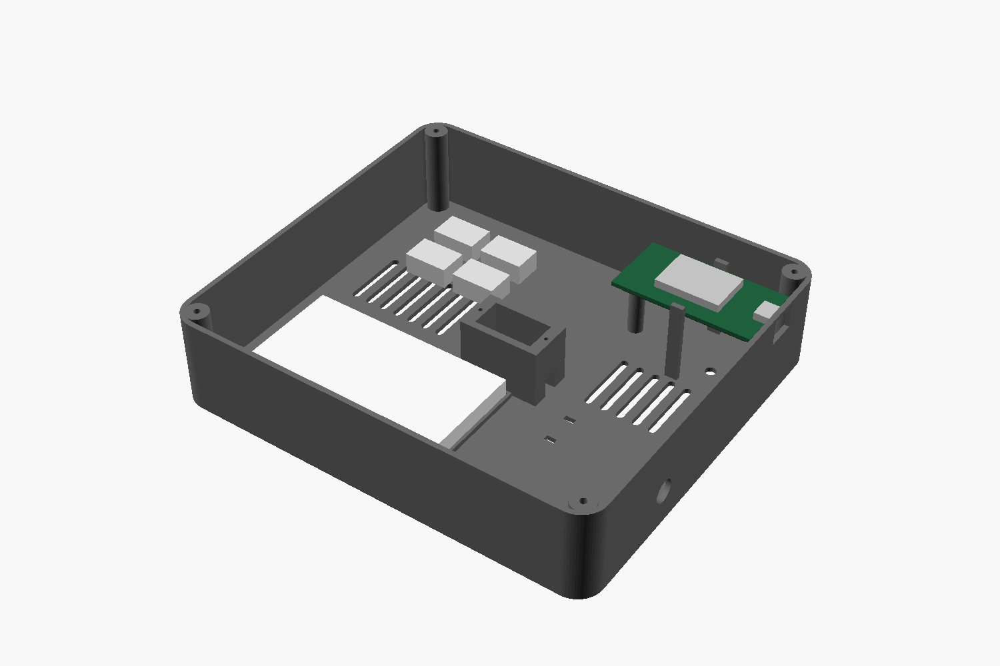
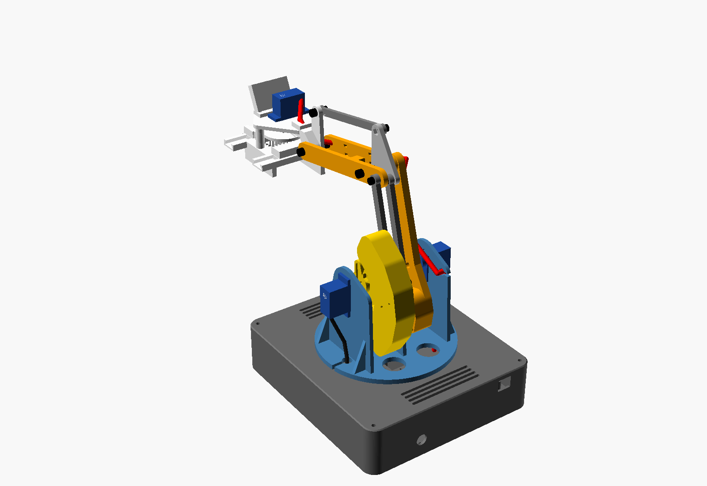

# BRACCIO — Schema di cablaggio (rev. B: GPIO diretti, zero saldature)

Niente PCA9685: i 4 SG90 sono pilotati dal PWM hardware (LEDC) dell'ESP32, a 50 Hz con risoluzione di 14 bit.
Il 5V dei servo arriva ai WAGO direttamente dal caricatore e non passa mai né dalla breadboard né dall'ESP32.

## Schema

```
            CARICATORE USB 5V ≥ 3A (2 porte)
             │ porta A                    │ porta B
             │ cavo USB normale           │ cavo USB sacrificato: taglia il connettore lato device,
             ▼                            │ spela 8 mm. Rosso = +5V, nero = GND (verifica col tester!)
      ┌──────────────┐                    │ bianco/verde: isolali col nastro
      │  ESP32       │                    ▼
      │  DevKit V1   │          ┌───────────────────┐   ┌───────────────────┐
      │              │          │ WAGO +5V (5 poli) │   │ WAGO GND (5 poli) │
      │  GND ────────┼──────────┼───────────────────┼───┤◄── massa comune    │
      │              │          │ ◄ rosso USB       │   │ ◄ nero USB        │
      │  GPIO33 ─┐   │          │ ◄ + cond. 1000µF  │   │ ◄ – cond. (banda) │
      │  GPIO25 ─┤   │          │ ◄ rosso servo 1-2 │   │ ◄ marrone 1-2     │
      │  GPIO26 ─┤   │          └───────────────────┘   └───────────────────┘
      │  GPIO27 ─┤   │          ┌───────────────────┐   ┌───────────────────┐
      └──────────┼───┘          │ WAGO +5V (5 poli) │   │ WAGO GND (5 poli) │
                 │              │ ◄ ponte dal primo │   │ ◄ ponte dal primo │
                 ▼              │ ◄ rosso servo 3-4 │   │ ◄ marrone 3-4     │
          BREADBOARD            │ ◄ (ESP32-CAM 5V)  │   │ ◄ (ESP32-CAM GND) │
   riga segnale ── 10 kΩ ── riga GND breadboard ── GND ESP32
   riga segnale ── Dupont ── arancione servo
```

## Mappa pin

| Giunto | Servo | GPIO ESP32 | Filo servo |
|---|---|---|---|
| J1 base | SG90 | **GPIO33** | arancione |
| J2 spalla (guancia sinistra) | SG90 | **GPIO25** | arancione |
| J3 gomito (guancia destra, manovella) | SG90 | **GPIO26** | arancione |
| J4 pinza | SG90 | **GPIO27** | arancione |
| tutti | — | — | rosso → WAGO +5V, marrone → WAGO GND |

Perché questi pin:
- 33, 25, 26 e 27 sono **adiacenti sullo stesso lato** del DevKit V1, quindi il cablaggio resta ordinato.
- **Non sono pin di strapping** (0, 2, 5, 12, 15), quindi non disturbano l'avvio.
- **Non emettono impulsi al boot** come fanno 1, 3, 5, 14 e 15. Liberi per il futuro: 13, 16–19, 21–23, 32.

Livelli logici: l'ESP32 manda un segnale a 3.3V a servo alimentati a 5V. Gli SG90 lo leggono senza problemi (soglia circa 1.5–2V), quindi non serve un level shifter.

## Collegare i servo senza saldare

Il connettore dell'SG90 è femmina a 3 poli, passo 2.54.
1. Infila **3 Dupont maschio-maschio** nel connettore del servo.
2. **Arancione:** l'altra estremità del jumper va in una riga della breadboard, collegata da un altro jumper al GPIO.
3. **Rosso e marrone:** taglia l'estremità libera del jumper, spela 8 mm e infilala nel WAGO.
   I jumper Dupont (26 AWG) reggono lo stallo di un SG90 (0.75 A) su 20 cm.
4. Blocca il connettore del servo e i tre jumper con un giro di nastro, così non si sfilano quando il braccio si muove.

Un'alternativa più pulita sono le prolunghe servo da 30 cm con un'estremità tagliata: rosso e marrone vanno al WAGO, l'arancione in breadboard.

## Protezioni

| Cosa | Perché |
|---|---|
| **Massa comune** (GND ESP32 → WAGO GND) | Senza, il segnale PWM non ha riferimento e i servo impazziscono. È l'errore n.1 |
| **Condensatore 1000–2200 µF ≥10V** sul bus WAGO | Assorbe lo spunto dei servo. **Polarità**: la banda con il "–" va al GND |
| **Pull-down 10 kΩ** tra ogni riga segnale e GND in breadboard | Durante il boot i GPIO sono flottanti e i servo scattano. Con il pull-down la linea resta bassa, niente impulsi, servo fermi |
| **Porte USB separate** per logica e servo | Un calo di tensione dei servo non resetta l'ESP32 |
| **Nessuna corrente servo in breadboard** | Le guide reggono circa 1 A e i contatti scaldano. In breadboard passano solo segnali e i 10 kΩ |

E-stop:
- **Software:** il firmware smette di generare gli impulsi (LEDC detach) e gli SG90 restano senza coppia.
- **Hardware:** stacca il cavo USB della porta B, cioè l'alimentazione dei servo. Se vuoi un pulsante, un interruttore a levetta con morsetti a vite in serie al rosso della porta B, sempre senza saldare.

## Budget corrente

| Condizione | Corrente |
|---|---|
| 4 SG90 a riposo | ~40 mA |
| Movimento con rampe (firmware) | 0.4–1.2 A |
| Caso peggiore teorico (tutti in stallo) | 4 × 0.75 = **3 A** |
| ESP32-CAM (futuro, dal bus WAGO) | picchi ~0.3 A |

→ Caricatore **5V ≥ 3A**. Se ne hai solo uno da 2A funziona lo stesso, ma solo con rampe lente e senza tenere la pinza stretta sotto carico.

## Checklist prima di dare corrente

1. Col tester sul cavo USB tagliato: rosso a +5V rispetto al nero. Alcuni cavi hanno colori non standard.
2. WAGO chiusi, nessun filo di rame scoperto fuori dal morsetto.
3. Condensatore con la banda "–" verso il GND.
4. GND dell'ESP32 collegato al WAGO GND.
5. Primo avvio con le **squadrette smontate**: il firmware porta i servo al centro (1500 µs), poi si montano braccio e manovella nella posizione di taratura.

## Montare l'ESP32 nella base



1. **Prima collega i Dupont femmina** ai pin che servono: GPIO 33, 25, 26, 27, GND e (se standalone) 5V.
   Piega i fili di 90° appena fuori dal connettore: sotto la scheda ci sono circa 6 mm.
2. Orienta la scheda con **i pin verso il basso** e la **micro-USB verso la parete posteriore** (−X), dove c'è l'apertura per il cavo.
3. Appoggiala sui due supporti ai lati corti e **premi al centro**: i due ganci sui lati lunghi scattano sul bordo del PCB.
   Per toglierla allarga leggermente i ganci con un dito.
4. Il cavo USB della porta A del caricatore entra dall'apertura della parete e alimenta l'ESP32.
   Lo stesso cavo serve per caricare il firmware.

## Percorso dei cavi e lunghezze



Il **fascio rosso** comprende i 3 fili del servo pinza e, se c'è, il 5V/GND della ESP32-CAM. Il percorso:
1. Dal servo pinza alla staffa del polso, con una fascetta attorno al braccetto.
2. Sulla **faccia esterna della piastra L** dell'avambraccio, con 2 fascette nelle asole.
3. Un'**ansa fuori dal gomito**, lato esterno, oltre la testa della vite.
4. Nella **canalina del braccio**, sul lato servo: il cavo si infila di taglio sotto i 3 ponticelli.
5. Nello spazio tra squadretta e guancia sinistra, con un'ansa di servizio di circa 4 cm.
6. **Asola della guancia sinistra**: il cavo entra di lato, il connettore non deve passare.
7. Giù fuori dalla guancia, poi nell'**asola del pavimento** della torretta.
8. Nella base, attraverso l'apertura centrale.
9. Ansa di yaw di circa 14 cm per i ±90° della base, poi **fascetta all'ancoraggio** nel fondo, accanto alla torre.
10. Breadboard e WAGO.

I **servo di spalla e gomito** scendono dal fondo del corpo fino alle asole del pavimento, una per lato, e poi seguono lo stesso percorso nella base.

| Cavo | Percorso misurato (pose peggiori) | Disponibile | Cosa serve |
|---|---|---|---|
| Servo pinza | 342 mm sul braccio + 141 ansa yaw + 110 nella base + 40 margine = **~63 cm** | SG90 25 cm | **2 jumper in catena**: maschio-femmina 20 cm + maschio-maschio 20 cm (o una prolunga servo da 30 cm) |
| ESP32-CAM 5V/GND | come sopra, ~63 cm | — | 3 jumper femmina-maschio in catena per filo; l'ultimo maschio va spelato nel WAGO |
| Servo spalla / gomito | 68 + 141 + 110 = **~32 cm** | SG90 25 cm + jumper 20 cm | il jumper maschio-maschio del cablaggio normale basta |
| Servo base | nella torre | SG90 25 cm | esce dall'asola in basso della torre |

Fra le pose estreme il fascio della pinza cambia lunghezza di soli **30 mm**: bastano le anse a gomito e spalla, non serve un cavo a spirale.

Fissa i giunti tra i Dupont con un giro di nastro, così non si sfilano quando il braccio si muove.
