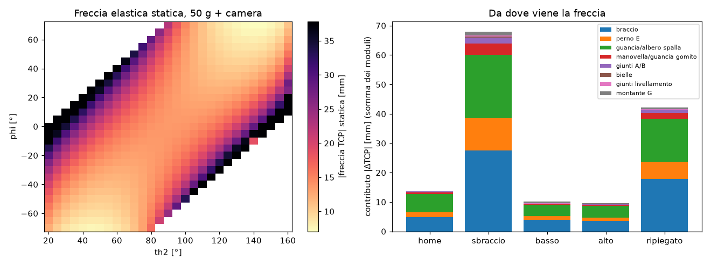
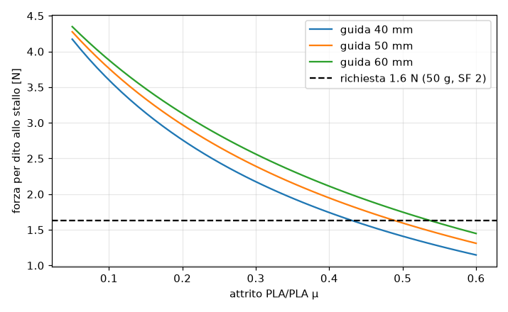
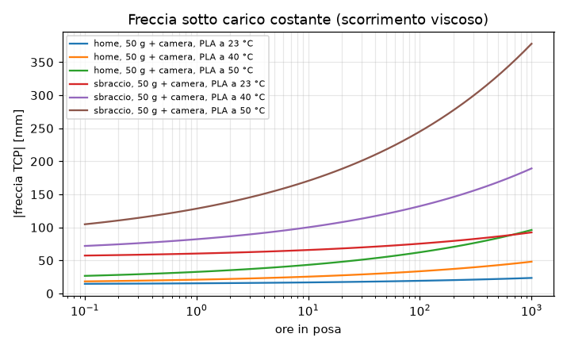
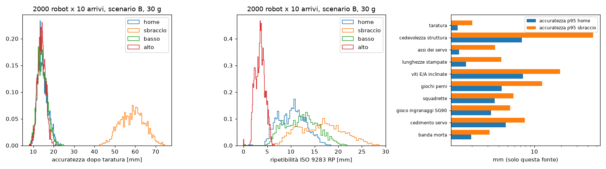
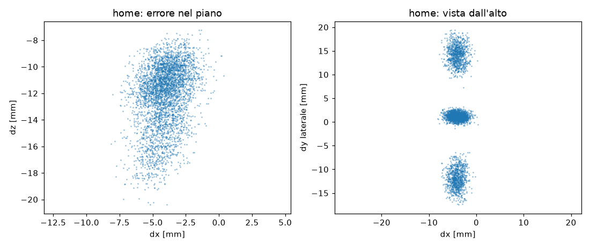

# BRACCIO — analisi strutturale e di tolleranze

Generato da `sim/structural/run_all.py` il 2026-10-01 sulle quote correnti di `cad/*.scad`
e sulle masse di `calc/torque.py`. PLA su Kobra S1: ugello 0.4, layer 0.2, 3 perimetri, gyroid 20%.
Materiale: E 3200 MPa nel piano / 2600 tra layer, rottura 50 / 27 MPa,
taglio interlaminare 15 MPa; sezioni con guscio pieno (perimetri 1.2, top/bottom 0.8) e nucleo gyroid al 12% di
rigidezza. Orientamenti di stampa: quelli di `cad/export.sh`. Carico di verifica: 50 g + ESP32-CAM, 2 piombi sulla manovella
e 4 sulla coda del braccio (punto di progetto di docs/01).

## Esiti

| verifica | ESITO | in breve |
|---|---|---|
| 1. Link e bielle: tensioni e freccia al TCP | **KO** | tensioni OK nei link (SF din min 1.9), dito ganascia SF 0.9 allo stallo; freccia TCP statica 13.7 mm in home, 54 mm a sbraccio |
| 2. Perni M3, fori e alberi dei servo | **KO** | perno E: p bordo din 47.9 MPa, vite 724 MPa; momento albero spalla 708 N·mm statico |
| 3. Pignone e cremagliere m1 + controlli STL | **KO** | denti OK (σ pignone 2.4 MPa allo stallo); ricoprimento 1.53 col gioco; ganasce: coda di rondine staccata dal corpo |
| 4. Code di rondine: attrito e impuntamento | **riserva** | presa 1.9 N/dito con μ 0.35 (rendimento 0.40), richiesti 1.6 N; impuntamento solo con μ > 1.08 |
| 5. Incastri a scatto (culla ESP32) | **KO** | ε 0.07% (ok), P(scheda non trattenuta) 47% |
| 6. Autofilettanti e dadi incassati | **KO** | estrazione OK; sedi dadi: due sedi fuse nel piano pinza, parete minima 0.55 mm |
| 7. Scorrimento viscoso e temperatura | **KO** | servo gomito in home 50 g: +59 K; freccia TCP x1.4 dopo 100 h a 23 °C |
| 8. Monte Carlo delle tolleranze | **KO** | home: accuratezza p95 19.2 mm, RP p95 15.1 mm (scenario B); squadretta non entra 28%, SG90 nelle guance 37% |

Il quadro in una riga: **i pezzi non si rompono, il braccio è cedevole**. Le tensioni sono basse quasi ovunque (eccezioni: il
dito della ganascia, il perno E e gli alberi dei servo). La rigidezza invece è dominata dall'eccentricità di ~33 mm tra il piano
del braccio e quello della biella motrice: la forza della biella flette fuori piano braccio, guancia e albero del servo spalla, e il
parallelogramma trasforma quelle piccole rotazioni in rotazioni dell'avambraccio, amplificate da 1/sin(e) vicino a e = 20°.
Ci sono poi tre difetti CAD che vanno corretti comunque (ganasce, dadi della staffa, dado di U corto).

## 1. Link e bielle: tensioni e freccia al TCP — KO

Carichi: 50 g + ESP32-CAM, 2 piombi manovella + 4 braccio. Statico = posa peggiore sulla griglia
(th2 20…160, phi −70…70, vincolo e = th2 − phi in 20…150, passo 5°). Dinamico = statico x 2.
Stallo = servo gomito a 2 kg·cm contro un ostacolo con e = 20° (biella 28.7 N).
Ammissibili: 50 MPa nel piano dei layer, 27 MPa tra layer, 15 MPa taglio interlaminare.
ESITO sul dinamico: OK se SF ≥ 2, riserva se 1.2–2, KO sotto.

| membro | posa peggiore th2/phi | σ stat MPa | σ din MPa | σ stallo MPa | amm. MPa | SF din | ESITO | nota |
|---|---|---|---|---|---|---|---|---|
| braccio (in piano) | 20/0 | 9.73 | 19.47 | 21.91 | 50 | 2.6 | OK | flessione nel piano + fuori piano + torsione, sezione al foro cavo x=20 |
| avambraccio piastra R (di fianco) | 60/0 | 0.90 | 1.80 | 2.02 | 50 | 27.8 | OK | momento della leva B al perno E |
| avambraccio taglio tra layer | 20/0 | 0.34 | 0.68 | 0.77 | 15 | 22.0 | OK | taglio all'asse neutro = piano dei layer |
| biella motrice (assiale) | 20/0 | 1.18 | 2.36 | 2.65 | 50 | 21.2 | OK | sezione netta all'occhio |
| biella livell. 1 (assiale) | 20/-20 | 0.56 | 1.13 | 1.27 | 50 | 44.4 | OK | sezione netta all'occhio |
| biella livell. 2 (assiale) | 20/-70 | 0.50 | 1.00 | 0.39 | 50 | 50.0 | OK | sezione netta all'occhio |
| triangolo (leve P1/U) | 20/-20 | 1.89 | 3.78 | 4.26 | 50 | 13.2 | OK |  |
| manovella | 20/0 | 4.53 | 9.06 | 10.20 | 50 | 5.5 | OK | piastra 4 mm, sezione 12 x 4 al mozzo |
| montante G (in piedi) | 20/-20 | 3.60 | 7.20 | 8.11 | 27 | 3.7 | OK | lastra 16 x 3 alla base, tensione verticale tra layer |
| guancia spalla (in piedi) | 55/35 | 5.33 | 10.65 | 7.20 | 27 | 2.5 | OK | flessione fuori piano sopra i fazzoletti |
| guancia spalla torsione | 20/0 | 3.88 | 7.76 | 8.74 | 15 | 1.9 | riserva | torsione attorno a Z |
| staffa polso (leva V) | 20/-70 | 0.49 | 0.99 | 1.11 | 50 | 50.5 | OK |  |
| dito ganascia: torsione gambo | presa | 13.28 | - | 16.60 | 15 | 0.9 (stallo) | KO | gambo 3.5 x 4, leva 29 mm, taglio sui piani dei layer |

Dito ganascia: freccia sotto la presa di stallo 3.17 mm. Con gambo 6 mm e dito spesso 5 mm il taglio
scende da 16.6 a 5.6 MPa (SF 2.7).

**Tensioni basse ovunque, tranne il dito.** I link reggono con margini ampi: il problema è la **rigidezza**.

#### Freccia elastica al TCP (statica, mm; colonne x,z nel piano, y laterale)

La catena è sommata risolvendo i due parallelogrammi con le cedevolezze di ogni elemento (`chain.py`).
Il meccanismo che domina: il braccio (y -22.4) e la biella motrice (y 11.0) stanno su piani distanti
33 mm. La forza della biella arriva al braccio tramite la vite E a sbalzo e lo flette **fuori piano**;
la stessa eccentricità torce/flette la guancia del servo spalla e l'albero dell'SG90. Ogni rotazione fuori piano θ sposta il piano
della biella di θ·Δy lungo il braccio, e il parallelogramma lo trasforma in una rotazione dell'avambraccio di θ·Δy/(20·sin e).

| posa | dx | dz | dy | |δ| statico | |δ| x2 | A: nervature braccio 6 mm + fazzoletti 50 mm |δ| | B: A + mozzo E 14 mm e perno d4 |δ| |
|---|---|---|---|---|---|---|---|
| home (90/0, e=90) | -2.07 | -13.40 | +1.71 | 13.66 | 27.33 | 5.94 | 4.49 |
| sbraccio (20/0, e=20) | -19.39 | -47.42 | +15.51 | 53.53 | 107.06 | 27.18 | 20.52 |
| basso (35/-60, e=95) | -7.53 | -6.26 | +1.32 | 9.88 | 19.75 | 4.42 | 3.33 |
| alto (130/50, e=80) | +3.89 | -8.31 | +1.70 | 9.33 | 18.67 | 4.12 | 3.11 |
| ripiegato (150/0, e=150) | -16.74 | -52.63 | -4.24 | 55.39 | 110.78 | 19.27 | 13.35 |

Contributi (modulo del solo contributo, mm):

| posa | braccio | perno E | guancia/albero spalla | manovella/guancia gomito | giunti A/B | bielle | giunti livellamento | montante G |
|---|---|---|---|---|---|---|---|---|
| home | 4.80 | 1.75 | 6.12 | 0.70 | 0.26 | 0.03 | 0.06 | 0.00 |
| sbraccio | 27.46 | 10.99 | 21.68 | 3.70 | 2.15 | 0.22 | 0.37 | 1.44 |
| basso | 3.98 | 1.33 | 3.75 | 0.26 | 0.13 | 0.04 | 0.18 | 0.41 |
| alto | 3.51 | 1.26 | 4.00 | 0.39 | 0.17 | 0.02 | 0.10 | 0.14 |
| ripiegato | 17.76 | 5.88 | 14.60 | 2.05 | 1.06 | 0.10 | 0.18 | 0.61 |

Effetto di e minimo (sbraccio con avambraccio orizzontale):

| lim e min ° | sbraccio mm | |δ| attuale | |δ| variante B | biella motrice N |
|---|---|---|---|---|
| 20 | 197 | 53.5 | 20.5 | 12.7 |
| 30 | 191 | 34.6 | 12.0 | 8.7 |
| 35 | 188 | 29.1 | 9.8 | 7.6 |
| 45 | 179 | 22.1 | 7.3 | 6.2 |

Ipotesi del modello (da tarare con una prova): rigidezza di bordo dei fori 1600 N/mm per mm, albero SG90
6e+04 N·mm/rad, guance come lastre 3 mm (fazzoletti rigidi a torsione), vite E con nocciolo d 2.39.
Prova consigliata: in `home` con 50 g in pinza misura l'abbassamento del TCP con un calibro a corsoio sul tavolo:
il modello prevede 13.7 mm, di cui la parte da braccio+guancia+albero sparisce se premi a mano il gomito verso il servo.

## 2. Perni M3, fori e alberi dei servo — KO

Pressione di contatto p = F/(d·t) nei fori (con il momento della vite dove il perno è a sbalzo:
p = F/(d·L) + 6·F·a/(d·L²)). Ammissibile breve 35 MPa, sostenuta per ore 10 MPa
(oltre, il foro si ovalizza per scorrimento viscoso). Flessione della vite sul nocciolo d 2.39 (vite tutta filettata
dei kit), confrontata con inox A2-70 (450 MPa); una 8.8 arriva a 640.

| giunto | posa peggiore | F stat N | p stat MPa | dove | p din MPa | SF p din | p in home MPa | M vite N·mm | σ vite din MPa | SF vite | ESITO |
|---|---|---|---|---|---|---|---|---|---|---|---|
| E (M3x40) | 20/0 | 19.2 | 24.0 | foro nel braccio (bordo, con il momento) | 47.9 | 0.7 | 9.0 | 485 | 724 | 0.6 | KO |
| W (M3x35) | 90/70 | 5.0 | 0.3 | piastra R | 0.5 | 64.1 | 0.1 | 26 | 39 | 11.5 | OK |
| A (M3x14) | 20/0 | 12.7 | 15.5 | foro nella manovella (bordo) | 31.1 | 1.1 | 5.3 | 116 | 173 | 2.6 | KO |
| B (M3x8) | 20/0 | 12.7 | 7.9 | piastra R (foro + dado, bordo) | 15.7 | 2.2 | 2.7 | 57 | 86 | 5.3 | OK |
| G (M3x12) | 20/-20 | 6.1 | 6.1 | montante (bordo) | 12.2 | 2.9 | 2.1 | 24 | 36 | 12.4 | OK |
| P1 (M3x8) | 20/-20 | 6.1 | 0.5 | biella 1 | 1.0 | 34.6 | 0.2 | 26 | 39 | 11.7 | OK |
| U (M3x6) | 20/-70 | 4.1 | 0.5 | biella 2 | 0.9 | 38.9 | 0.2 | 15 | 23 | 19.8 | OK |
| V (M3x12) | 20/-70 | 4.1 | 0.5 | biella 2 | 0.9 | 38.9 | 0.2 | 15 | 23 | 19.8 | OK |

Osservazioni:
- **E** è l'unico perno serio: è una mensola di 26 mm dal braccio, e la biella motrice
  carica la piastra R all'estremità libera. Il momento genera nel foro del braccio (lungo solo 6.5 mm)
  una pressione di bordo alta, che in poche ore di posa ovalizza il foro: il gioco del gomito cresce col tempo.
  Con mozzo d12 x 8 mm (foro lungo 14) la pressione di bordo scende di circa (6.5/14)² = 0.22 volte.
- **A** è il secondo: vite a sbalzo di 9.1 mm dalla piastra della manovella da 4 mm.
- I perni ruotano sul filetto (viti dei kit tutte filettate): il filetto lima il foro. Dove ruota qualcosa (E, W, G, V, A, B, P1, U)
  conviene una vite a gambo parziale (ISO 4762 M3x40: filetto 18 mm, il gambo liscio copre braccio, piastra L e triangolo)
  oppure un tubetto di ottone 4/3 mm incollato nel foro come boccola.
- **A, B, P1, U ruotano con un dado normale nella sede**: la vite gira insieme alla parte che ruota e si avvita o svita da sola
  a ogni ciclo. Serve frenafiletti medio (o dadi autobloccanti sottili, sedi da 3.0 mm invece di 2.6).

Impegno del filetto nel dado incassato, lunghezze di docs/04 (dado da 2.4 mm a filo della faccia):

| giunto | vite | impegno mm | filetti | esito |
|---|---|---|---|---|
| A | M3x14 | 2.4 | 4.8 | OK |
| B | M3x8 | 1.9 | 3.8 | corto |
| P1 | M3x8 | 2.4 | 4.8 | OK |
| U | M3x6 | 1.4 | 2.8 | corto |

Nota: l'intestazione di `cad/linkage.scad` indica A M3x20, B/P1/U M3x10, V M3x10, mentre docs/04 dice A M3x14, B/P1 M3x8,
U M3x6, V M3x12. Le lunghezze di docs/04 sono quelle giuste per A (con M3x20 la punta urta il montante G), per U no.

Alberi dei servo (SG90: boccole in plastica, nessun cuscinetto). Il momento flettente è preso rispetto alla boccola
(~3.5 mm dentro la guancia) e confrontato, come regola pratica, con la coppia nominale (157 N·mm):

| albero | posa peggiore | F radiale N | M stat N·mm | M din N·mm | rif. N·mm | SF | ESITO |
|---|---|---|---|---|---|---|---|
| albero spalla | 20/0 | 19.6 | 708 | 1417 | 157 | 0.11 | KO |
| albero gomito | 20/0 | 12.5 | 255 | 509 | 157 | 0.31 | KO |

La biella motrice chiude il suo anello di forze attraverso **entrambi** gli alberi (braccio → albero spalla → torretta →
albero gomito → manovella): la forza radiale non è "< 1.5 N" come in docs/01, ma 4–13 N statici, con braccio di leva fino
a 38 mm.

## 3. Pignone e cremagliere m1 + controlli STL — KO

Pignone m1 z32 (r 16.0), due cremagliere: F tangenziale = T/(2r) per dente. Fascia utile 5.7 mm
(sovrapposizione pignone/cremagliera). Lewis: Y pignone 0.365, cremagliera 0.485.
Hertz al primitivo con E* = E/2(1−ν²).

| caso | F per dente N | σ Lewis pignone MPa | σ Lewis cremagliera MPa | τ piede cremagliera MPa | p Hertz MPa |
|---|---|---|---|---|---|
| stallo dichiarato 1.6 kg·cm | 4.9 | 2.4 | 1.8 | 0.52 | 9.6 |
| x2 dinamico | 9.8 | 4.7 | 3.5 | 1.04 | 13.5 |
| stallo reale 2.0 kg·cm | 6.1 | 2.9 | 2.2 | 0.65 | 10.7 |

Ammissibile a fatica per denti in PLA ~18 MPa (35% della rottura): SF sul dinamico 3.7.
I denti non sono il limite: il limite di forza della pinza è l'attrito delle guide (§4) e il dito (§1).

**Salto dei denti.** La spinta radiale F·tan20° = 1.78 N allontana la cremagliera finché
il gioco della coda di rondine lo permette: 0.30 mm (clr_slide 0.3).
Ricoprimento 1.82 a gioco nullo, 1.53 con la cremagliera tutta indietro; si salta sotto 1.0, cioè oltre
0.83 mm di allontanamento. Gioco sul dente 0.37 mm → ±0.18 mm per dito.

**Orientamento.** Il pignone è stampato in piano: profilo nel piano XY, preciso. Le ganasce sono stampate di fianco
(Y della cremagliera in verticale): i fianchi dei denti diventano superfici a 20° dall'orizzontale, uno dei due è uno
**sbalzo a 70°** e il gradino dei layer da 0.16 vale 0.15 mm sul fianco, quanto tutto il gioco di progetto (0.15).
Le tensioni di piede restano nel piano dei layer (σ lungo X), il taglio al piede va sui piani dei layer ma è < 1 MPa.

Controllo degli STL generati con gli stessi `part` di `cad/export.sh` (orientati come si stampano): gusci connessi,
area a sbalzo oltre 45° e 60° dalla verticale e soffitti orizzontali (mm², piano del piatto escluso).

| parte | gusci | sbalzo >45° mm² | >60° mm² | soffitti mm² |  |
|---|---|---|---|---|---|
| 00_tolerance_coupon | 27 | 0 | 0 | 710 |  |
| 01_base_tray | 1 | 21 | 14 | 89 |  |
| 03_turret | 1 | 37 | 21 | 829 |  |
| 02_base_lid | 2 | 0 | 0 | 473 | labbro appoggiato sul piano (a contatto: in stampa si fonde) |
| 04_upper_arm | 1 | 0 | 0 | 493 |  |
| 05_upper_arm_lid | 1 | 0 | 0 | 0 |  |
| 06_crank | 1 | 0 | 0 | 1685 |  |
| 07_crank_lid | 1 | 0 | 0 | 0 |  |
| 08_crank_spacer | 1 | 0 | 0 | 0 |  |
| 09_drive_rod | 1 | 0 | 0 | 22 |  |
| 10_lev_rod | 1 | 0 | 0 | 0 |  |
| 11_lev_rod2 | 1 | 0 | 0 | 0 |  |
| 12_lev_link | 1 | 0 | 0 | 22 |  |
| 13_forearm | 1 | 110 | 61 | 73 |  |
| 14_elbow_wrist_spacers | 3 | 0 | 0 | 0 |  |
| 15_wrist_bracket | 1 | 20 | 13 | 0 |  |
| 16_gripper_housing | 1 | 0 | 0 | 2 |  |
| 17_gripper_base_plate | 1 | 0 | 0 | 40 |  |
| 18_gripper_pinion | 1 | 0 | 0 | 144 |  |
| 19_gripper_jaw_x2 | 1 | 187 | 187 | 0 |  |
| 20_esp32cam_cradle | 1 | 90 | 90 | 16 |  |

**Difetto CAD nelle ganasce:** in `rack()` la coda di rondine è `offset(delta = -clr_slide)` del trapezio, quindi anche il
lato attaccato al corpo arretra di 0.3 mm: a metà cremagliera la sezione ha 2 contorni separati,
tra coda di rondine e corpo resta una fessura di 0.3 mm. La coda di rondine è attaccata solo all'estremità,
dove tocca il gambo del dito (un'unione di 0.75 x 4 mm): in uso si stacca o flette, e la cremagliera non è guidata. Il provino (`tolerance_coupon.scad`, `sliders()`) ha il collo,
la cremagliera no.

## 4. Code di rondine: attrito e impuntamento — riserva

Leve (frame cremagliera): la presa avviene sull'asse del pignone, 16.0 mm in X e 18.4 mm in Z
dalla linea dei denti. La coppia F·(dx, dz) ruota la cremagliera nella guida (lunga 40 mm, sempre tutta impegnata):
due reazioni alle estremità, amplificate dal cuneo della coda di rondine a 60° (1.73 per le forze laterali,
2 verso l'alto). In più la spinta radiale del dente (tan 20°).

| μ | rendimento presa | forza per dito N | rispetto al richiesto | rendimento con guida 50 mm |
|---|---|---|---|---|
| 0.15 | 0.64 | 3.14 | 1.92 | 0.68 |
| 0.25 | 0.50 | 2.44 | 1.49 | 0.54 |
| 0.35 | 0.40 | 1.94 | 1.19 | 0.44 |
| 0.5 | 0.29 | 1.41 | 0.86 | 0.33 |

Forza al dente 4.9 N per cremagliera (1.6 kg·cm); torque.py assume 4.9 N per dito e ne chiede 1.6.
Con μ 0.35 si perde il 60% nelle guide: la presa reale è 1.9 N per dito
(margine 1.19 sul richiesto, che già contiene SF 2).

**Effetto cassetto.** In corsa libera la spinta al dente è sfalsata dal centro guida di 6.2 mm (X) e
5.1 mm (Z): si impunta solo con μ > 1.08. Rapporto lunghezza guida / leva della presa
1.64 (regola pratica ≥ 1.5): ok, ma con poco margine.

**Gioco.** Con clr_slide 0.3 la cremagliera ruota liberamente di 0.99° (imbardata) e 0.86° (beccheggio)
prima di toccare: il centro del dito si sposta di ±0.28 mm. I fianchi a 60° della gola, stampata in piano, hanno il
gradino dei layer da 0.2 mm (creste da 0.10 mm): i primi movimenti le spianano.

## 5. Incastri a scatto (culla ESP32) — KO

Lamella 2 x 5 mm alta 32.2 mm (dente a 29.7 mm dal fondo), stampata in piedi:
la tensione di flessione al piede è verticale, cioè **tra i layer** (E 2600 MPa, allungamento a rottura ~1%,
non il 2% del PLA nel piano). La lamella sta a clr_pocket 0.2 dal bordo del PCB, quindi il dente sovrappone
snap_hook − clr_pocket al PCB nominale (28.3 mm). Forze per **due** ganci.

| snap_hook mm | sovrapposizione mm | ε al piede % | forza laterale N | inserimento N (2 ganci) | sfilamento N (2 ganci) | P(non trattiene) % | P(ε > 1%) % |
|---|---|---|---|---|---|---|---|
| 0.4 | 0.20 | 0.07 | 0.20 | 0.21 | 7.3 | 46.9 | 0.00 |
| 0.6 | 0.40 | 0.14 | 0.40 | 0.51 | 13.4 | 1.7 | 0.00 |
| 0.8 | 0.60 | 0.20 | 0.60 | 0.90 | 18.6 | 0.0 | 0.00 |

Monte Carlo (20000): PCB dei cloni 28.0–28.6 mm, dente stampato più basso di 0.1 ± 0.05 (è largo quanto una linea),
posizione della lamella ±0.05. "Non trattiene" = sovrapposizione < 0.05 mm su almeno un lato.

La lamella è lunghissima rispetto al dente: la deformazione è un decimo del limite, ma il gancio tiene poco e il dente
da 0.4 mm è al limite di ciò che un ugello da 0.4 riproduce. Il rischio non è rompere, è che la scheda non resti in sede
(i Dupont tirano la scheda verso il basso: lì la spingono contro gli appoggi, quindi il gancio lavora poco in esercizio).

## 6. Autofilettanti e dadi incassati — KO

Estrazione: taglio su un cilindro di diametro medio tra vite e preforo, sui piani dei layer
(τ 15 MPa), filetto formato proporzionale a (d − preforo). Il carico è x2. Viti delle linguette:
oltre alla coppia, riprendono il momento flettente sull'albero spalla di §2 (708 N·mm) come coppia di forze a passo
27.8 mm.

| dove | vite | preforo | impegno mm | F estrazione N | carico N | SF | ESITO | nota |
|---|---|---|---|---|---|---|---|---|
| coperchio base (4) | M3 | 2.5 | 5.6 | 538 | 1.0 | 269 | OK | colonnine d9 verticali |
| piastra pinza (2) | M3 | 2.5 | 9.3 | 893 | 6.0 | 74 | OK | colonnine d7, regge cremagliere e payload |
| culla camera (2) | M3 | 2.5 | 3.0 | 288 | 1.0 | 144 | OK | solo lo spessore del piano (3 mm) |
| linguette SG90 guance (2/servo) | M2 | 1.6 | 3.0 | 204 | 31.1 | 3 | OK | fori orizzontali, M2 del servo |

Preforo 2.5 per M3 autofilettante: corretto per PLA (2.4–2.6). I fori stampati escono ~0.1 più stretti: la vite entra dura,
le colonnine d7/d9 hanno parete ≥ 2.25 mm (≥ 0.75·d), non si spaccano. Il rischio vero è stringere troppo: nel PLA una M3 in
6 mm spana a ~0.4 N·m, a mano con un cacciavite piccolo ci si arriva facilmente. I fori pilota delle linguette (1.6 per la M2
del servo) stanno in guance da 3 mm stampate in piedi, con asse orizzontale: lì la vite apre i layer, avvitare piano.

Dadi incassati (chiave 5.5 + 2·clr_pocket = 5.9, vertici a
6.81): parete minima tra la sede e qualunque altro
contorno, misurata sulla sezione del CAD a metà sede. 2 linee da 0.4 = 0.8 mm è il minimo che il slicer stampa pieno;
sotto resta una linea sola (o il riempimento dei vuoti) e sono proprio i vertici del dado a spingerla quando si stringe.
ESITO: OK ≥ 1.2 mm (3 perimetri), riserva sotto, KO se le sedi si toccano.

| sede | centro (x, y) | parete min mm | linee da 0.4 |  | ESITO |
|---|---|---|---|---|---|
| biella motrice (A) | (0.0, 0.0) | 0.59 | 1.5 |  | riserva |
| triangolo (P1, U) | (-20.0, 0.0) | 1.59 | 4.0 |  | OK |
| triangolo (P1, U) | (0.0, -30.0) | 1.59 | 4.0 |  | OK |
| avambraccio piastra R (B) | (-20.0, 0.0) | 3.59 | 9.0 |  | OK |
| coda braccio (coperchio) | (-45.9, -8.1) | 0.63 | 1.6 |  | riserva |
| coda braccio (coperchio) | (-45.9, 8.1) | 0.63 | 1.6 |  | riserva |
| manovella (coperchio) | (22.0, -13.9) | 0.59 | 1.5 |  | riserva |
| manovella (coperchio) | (22.0, 13.9) | 0.59 | 1.5 |  | riserva |
| piano pinza (staffa) | (18.0, -1.5) | 0.55 | 1.4 | **due sedi fuse** | KO |

**Piano pinza:** le due viti della staffa sono a x_back + 3.5 e x_back + 8.5, cioè a 5 mm di interasse.
Un dado M3 è largo 5.5 mm sulle chiavi: due dadi non ci stanno (si sovrappongono di
0.5 mm) e le due sedi esagonali nel CAD sono fuse in una.

## 7. Scorrimento viscoso e temperatura — KO

Modello: cedevolezza J(t,T) = [1 + a·(t·a_T)^0.25]/E(T), a tarato perché a 23 °C dopo 1000 h il modulo apparente sia
E/1.8; spostamento tempo-temperatura di Arrhenius (Ea 200 kJ/mol); E(T) cala del 10% a 40 °C e del 30% a 50 °C
(Tg del PLA ~58 °C). Valori tipici di letteratura per PLA stampato: ordine di grandezza, non dati del filamento.

Fattore di aumento della freccia (rispetto all'elastica a 23 °C):

| T | 1 h | 8 h | 100 h | 1000 h |
|---|---|---|---|---|
| 23 °C | 1.14 | 1.24 | 1.45 | 1.80 |
| 35 °C | 1.38 | 1.61 | 2.10 | 2.91 |
| 40 °C | 1.59 | 1.91 | 2.62 | 3.79 |
| 45 °C | 1.93 | 2.41 | 3.45 | 5.19 |
| 50 °C | 2.54 | 3.29 | 4.93 | 7.66 |

**Temperatura dei servo.** Il driver analogico dell'SG90 manda impulsi a piena tensione con duty ~ coppia/stallo, quindi
tenere una coppia costa P ≈ duty·5 V·0.75 A. Con R_th 35 K/W tra cassa e aria (assunzione):

| posa tenuta | spalla: duty / P / ΔT cassa | gomito: duty / P / ΔT cassa |
|---|---|---|
| home, pinza vuota | 0.00 / 0.00 W / +0 K | 0.13 / 0.50 W / +18 K |
| home, 50 g + camera | 0.00 / 0.00 W / +0 K | 0.45 / 1.69 W / +59 K |
| sbraccio, 50 g + camera | 0.47 / 1.76 W / +62 K | 0.45 / 1.69 W / +59 K |

Il gomito con 2 piombi resta sempre caricato (scelta voluta, per non flottare nel gioco): in home con 50 g + camera la cassa
arriva a ~82 °C a regime (costante di tempo di qualche minuto). È sopra la Tg del PLA (~58 °C): il bordo della
finestra nella guancia e le viti delle linguette perdono presa. Già a 45 °C il PLA scorre 1.9
volte più che a 23 °C. Lo stesso vale per la spalla tenuta a sbraccio. È anche un limite del servo, non solo del PLA.

Freccia del TCP sotto carico costante (mm; la parte dell'albero del servo non scorre):

| posa | elastica | 23 °C 8 h | 23 °C 100 h | 40 °C 8 h | 40 °C 100 h | 50 °C 8 h | 50 °C 100 h |
|---|---|---|---|---|---|---|---|
| home, 50 g + camera | 13.7 | 16.6 | 19.2 | 24.9 | 33.7 | 42.0 | 62.4 |
| sbraccio, 50 g + camera | 53.5 | 65.2 | 75.4 | 97.9 | 132.2 | 165.2 | 245.1 |

Tensioni sostenute in `home` contro il limite a lungo termine (30% della rottura, ridotto con E(T); fori: 10 MPa):

| dove | valore MPa | T locale °C | limite MPa | ESITO |
|---|---|---|---|---|
| braccio (fuori piano), home | 3.6 | 23 | 15.0 | OK |
| foro E nel braccio, bordo | 9.0 | 23 | 10.0 | riserva |
| foro A nella manovella, bordo | 5.3 | 23 | 10.0 | OK |
| guancia spalla attorno al servo | 3.2 | 23 | 8.1 | OK |
| guancia gomito attorno al servo | 1.0 | 82 | 0.0 | KO |
| dito che stringe a stallo per ore | 13.3 | 23 | 4.5 | KO |

I piombi non sono un problema di scorrimento: 20 g ciascuno, tensioni nelle sedi < 0.1 MPa. Lo sono indirettamente: tengono
il braccio bilanciato, quindi la spalla in home lavora a coppia quasi nulla e resta fredda.

## 8. Monte Carlo delle tolleranze — KO

2000 robot virtuali x 10 arrivi per posa (20000 campioni), payload 30 g senza camera,
taratura in home a pinza vuota (si legge l'angolo vero di braccio, avambraccio e base; errore di lettura ±0.3°, scala ±0.3°/90°).
Accuratezza = distanza del baricentro degli arrivi dal punto comandato; ripetibilità = RP ISO 9283 (media + 3σ delle distanze
dal baricentro). Errore 3D: piano XZ dal solutore esatto dei parallelogrammi, laterale da imbardata della base e flessione.

Fonti e distribuzioni:
- fori stampati -0.08 ± 0.06 mm sul diametro, viti M3 2.88–2.98; giochi radiali = metà della somma dei due fori;
  un perno con forza > 0.3 N sta appoggiato dal lato del carico (offset ripetibile), sotto è in un punto a caso del gioco;
- interasse dei fori ±0.07 mm, ritiro del PLA 0–0.4% uguale per tutto il robot;
- asse del servo gomito rispetto a quello della spalla ±0.15 mm (finestre + linguette);
- SG90: banda morta 5–10 µs (0.45–0.9°), cedimento sotto carico fino a 2–6° alla coppia di stallo (anello proporzionale),
  gioco ingranaggi 1–2° (solo scenario B), scanalato 0.2–0.6°, squadretta nella tasca dove non è avvitata (torretta, manovella);
  sotto 5 N·mm di coppia il giunto non è appoggiato a un lato e si ferma in un punto a caso;
- base: attrito della corona (44 N·mm) ferma la torretta prima del bersaglio, dal lato da cui arriva;
- viti E e A inclinate nel foro se il loro momento supera il precarico (0–40 N sulla testa);
- cedevolezza strutturale di §1 con incertezza ±30%.

Scenario A: l'anello del servo compensa il gioco degli ingranaggi (il potenziometro è sull'uscita). Scenario B: no.

| scenario | posa | accuratezza mediana mm | accuratezza p95 mm | RP mediana mm | RP p95 mm |
|---|---|---|---|---|---|
| anello chiuso | home | 13.5 | 18.6 | 7.6 | 11.6 |
| anello chiuso | sbraccio | 56.3 | 66.0 | 12.3 | 18.8 |
| anello chiuso | basso | 12.6 | 17.1 | 9.1 | 14.2 |
| anello chiuso | alto | 13.0 | 16.0 | 2.6 | 4.0 |
| gioco SG90 non compensato | home | 14.3 | 19.2 | 10.4 | 15.1 |
| gioco SG90 non compensato | sbraccio | 58.9 | 68.0 | 16.5 | 24.3 |
| gioco SG90 non compensato | basso | 14.1 | 18.7 | 12.3 | 18.0 |
| gioco SG90 non compensato | alto | 14.1 | 17.3 | 3.5 | 5.2 |

Sensibilità (scenario B, una fonte alla volta + taratura; p95 in mm):

| fonte | home accuratezza | home RP | sbraccio accuratezza | sbraccio RP |
|---|---|---|---|---|
| banda morta | 1.95 | 1.72 | 3.14 | 2.86 |
| cedimento servo | 4.77 | 6.37 | 7.81 | 10.23 |
| gioco ingranaggi SG90 | 3.25 | 3.88 | 5.35 | 6.35 |
| squadrette | 3.58 | 4.94 | 5.82 | 7.86 |
| giochi perni | 4.29 | 0.00 | 12.20 | 0.00 |
| viti E/A inclinate | 7.46 | 0.00 | 19.44 | 0.00 |
| lunghezze stampate | 1.71 | 0.00 | 4.27 | 0.00 |
| assi dei servo | 1.43 | 0.00 | 3.61 | 0.00 |
| cedevolezza struttura | 7.23 | 0.00 | 45.71 | 0.00 |
| taratura | 1.38 | 0.00 | 2.01 | 0.00 |

#### Accoppiamenti (100000 campioni)

Componenti reali: SG90 cloni 22.5–23.2 x 12.0–12.6, squadrette 31–33.5 mm (punte 3.8–4.2, mozzo 6.9–7.3), dadi M3
chiave 5.32–5.50, piombi 22.18 x 13.7 (±0.15 / ±0.10 nel lotto). Fori/tasche stampati -0.08 ± 0.06,
lunghezze delle tasche −0.10 ± 0.07, ponti delle finestre verticali che calano 0.05–0.3, piede d'elefante 0–0.2 sulle aperture
appoggiate al piatto, creste dei layer 0–0.1 sui fianchi della gola a coda di rondine.

| accoppiamento | P(non entra senza limare) % | P(gioco eccessivo) % | nota |
|---|---|---|---|
| SG90 nelle finestre delle guance (ponte in alto) | 36.6 | 0.2 | finestra verticale: il lato alto è un ponte che cala |
| SG90 nel piano pinza (stampato capovolto) | 28.5 | – | foro sul piatto: piede d'elefante 0–0.2 |
| SG90 nella torre della base | 11.9 | – |  |
| squadretta nella tasca (horn_len 32.5) | 28.1 | 67.7 | gioco angolare mediano 1.3° dove non è avvitata |
| dado M3 nella sede esagonale | 0.0 | 1.7 | gioco eccessivo = il dado gira nella sede |
| piombo nella sede del braccio | 0.4 | 0.1 | gioco eccessivo = sporge oltre la sede, il coperchio non chiude |
| piombo nella sede della manovella (aperta sul piatto) | 5.5 | 0.1 | piede d'elefante sull'imbocco |
| cremagliera nella coda di rondine | 0.0 | 0.0 | gioco per lato mediano 0.19 mm (gioco eccessivo > 0.4) |
| vite M3 nel foro passante 3.2 | 0.2 | – | va ripassato con punta da 3.2 |
| vite M3 nel foro di rotazione 3.3 | 0.0 | – |  |
|   variante horn_len 33.5 | 0.1 | – |  |
|   variante horn_len 34.0 | 0.1 | – |  |
|   variante clr_pocket 0.25 (SG90 guance) | 22.4 | – |  |
|   variante clr_pocket 0.3 (SG90 guance) | 10.4 | – |  |
|   variante clr_pocket 0.3 + 0.3 sul lato del ponte (SG90 guance) | 0.0 | – |  |
|   variante clr_pocket 0.3 (SG90 piano pinza) | 3.5 | – |  |
|   variante clr_pocket 0.3 (SG90 torre base) | 0.1 | – |  |

## Raccomandazioni (in ordine di sezione)

1. Braccio: due nervature 2.5 x 6 mm sui bordi della faccia lato servo (x 24…74, la canalina resta in mezzo): I fuori piano da 181 a 976 mm⁴. Ricontrollare con cad/check_grid.sh.
2. Guance torretta: fazzoletti esterni da 25 a 50 mm di altezza e profondi 12 (stanno a x ±24, fuori dal servo).
3. Gomito: mozzo esterno d12 x 8 mm sul braccio attorno al foro E (foro lungo 14 invece di 6.5) e perno E da 4 mm (vite M4 o spina rettificata): con le due modifiche sopra la freccia in home scende da 13.7 a 4.5 mm.
4. Strutturale vero: il rimedio di fondo è eliminare l'eccentricità (braccio a forcella con una seconda piastra oltre il piano della biella, perno E in doppio taglio). Tutte le cedevolezze del gomito scalano con Δy².
5. lim_e minimo da 20° a 35°: perde 10 mm di sbraccio ma divide per ~3 forza nella biella e sensibilità (1/sin²e).
6. Dito ganascia: stem_t 3.5 → 6 mm e tab[1] 4 → 5 mm (taglio interlaminare 16.6 → 5.6 MPa).
7. Perno E in acciaio d4 (vite M4x45 o spina) con fori 4.2/4.3; in alternativa M3 classe 12.9 a gambo parziale.
8. A: integrare il distanziale d7 nella manovella (mozzo stampato pieno alto 4.9 mm) e crank_t 4 → 6 mm al perno.
9. A, B, P1, U: frenafiletti medio sul dado incassato (ruotano: un dado normale si svita).
10. U: M3x8 invece di M3x6 (oggi impegna ~1.4 mm, meno di 3 filetti); B: M3x10 invece di M3x8.
11. Viti a gambo parziale (ISO 4762) o boccole in ottone 4/3 nei fori che ruotano, per non limare il PLA col filetto.
12. Alberi SG90: aggiungere un appoggio esterno al braccio (anello coassiale d≈36 sulla guancia −Y che fa da boccola al mozzo, o un perno folle M3 dalla guancia +Y attraverso la manovella), oppure passare a MG90S (cuscinetto sull'uscita).
13. wrist.scad, rack(): aggiungere il collo come nel provino, nel 2D della coda di rondine `translate([-(dt_top / 2 - clr_slide), -clr_slide - 0.01]) square([dt_top - 2 * clr_slide, clr_slide + 0.02]);` (largo 7.4 mm, passa nella fessura da 8).
14. Ganasce: stampare la cremagliera in piano (fianchi verticali) separandola dal dito, con 2 viti M3x8 e dado nel gambo; in alternativa tenerle di fianco ma a layer 0.12 (gradino 0.11 mm) e bl 0.15 → 0.25.
15. Gioco del dente 0.37 mm: va bene per una pinza; se serve precisione, clr_slide 0.3 → 0.2 dopo il provino.
16. Grasso al PTFE/silicone sulle code di rondine: μ 0.35 → 0.15 porta la presa da 1.9 a 3.1 N per dito.
17. rack_len 40 → 50 mm (e y_half 36 → 41) se c'è spazio: rendimento 0.40 → 0.44.
18. clr_slide: tenere 0.3 finché il provino non dice altro; sotto 0.2 le creste dei layer della gola fanno impuntare.
19. snap_hook 0.4 → 0.8 mm nella base (solo per la culla ESP32): sovrapposizione 0.6, ε 0.20%, P(non trattiene) da 47% a 0.0%.
20. Raccordo r 1 mm al piede della lamella (oggi spigolo vivo su un piano di layer).
21. Staffa → piano pinza: interasse viti 5 → 7.5 mm (x_back + 2.5 e x_back + 10, flangia della staffa 12 → 14 mm), oppure una vite sola M3 con dado + perno di centraggio.
22. Biella motrice: occhio d8 → d9 attorno al dado di A, o sede ruotata di 30° (lato piatto verso l'estremità).
23. Coda del braccio e manovella: orecchie delle viti del coperchio r 4 → 5 mm (parete al dado da 0.6 a 1.6 mm).
24. Coppia di serraggio delle autofilettanti nel PLA: a mano, fermarsi al contatto + 1/8 di giro.
25. Riposo: non lasciare il braccio alimentato in posa per ore con payload; a fine lavoro `estop` o una posa di parcheggio appoggiata (pinza sul tavolo) così nessun servo tiene coppia.
26. Guance: fori di aerazione o 2 mm di distanza tra cassa del servo e PLA sui lati lunghi (la finestra ora è a contatto).
27. Se si vuole lasciare il braccio in posa a lungo, stampare torretta e braccio in PETG o PLA+ ricotto (HDT 60 → 80+ °C).
28. Pinza: non chiudere a stallo su un oggetto per ore (dito in taglio interlaminare): il firmware dovrebbe aprire di 0.5 mm dopo il contatto.
29. horn_len 32.5 → 33.5: con squadrette fino a 33.5 mm la tasca da 32.9 non le prende nel 28% dei casi (0.1% con 33.5); la tasca un po' lunga non costa nulla, la squadretta è centrata dall'albero.
30. Avvitare la squadretta anche nella torretta e nella manovella (2 viti autofilettanti nei fori delle punte, come nel braccio): toglie il gioco angolare della tasca (mediano 1.3°, sulla base ±1.4 mm al TCP in home).
31. Finestre SG90: clr_pocket 0.2 → 0.3 per i servo (guance 37% → 10%, torre base 12% → ~0%), e nelle guance altri 0.3 mm sul lato alto (ponte che cala) → 0%. Piano pinza: smusso 0.5 x 45° sul lato del piatto o compensazione del piede d'elefante nello slicer.
32. Sedi dei piombi della manovella: smusso 0.4 x 45° sull'imbocco (lato piatto) contro il piede d'elefante.
33. Corona della base: grasso al PTFE e appoggio su un anello più piccolo; l'attrito ferma la torretta prima del bersaglio dal lato da cui arriva (errore bimodale ±0.5–1° → ±2–3 mm al TCP). In firmware: arrivare sempre dallo stesso verso (piccolo sovra-corsa e ritorno) dimezza la ripetibilità della base.
34. Ripetibilità della spalla in home: col braccio verticale la coppia di gravità è nulla con qualunque contrappeso, quindi il giunto si ferma in un punto a caso della banda morta e dei giochi. Un elastico o una molla a torsione tra braccio e torretta da ~0.1 kg·cm costanti lo tiene sempre appoggiato dallo stesso lato.

## Cosa misurare per tarare i modelli

- Freccia in `home` con 50 g in pinza (calibro a corsoio dal tavolo), poi la stessa premendo a mano il gomito verso la guancia
  del servo: la differenza è la parte fuori piano (braccio + guancia + albero) che il modello stima.
- Gioco del gomito a servo spento: spostamento della punta dell'avambraccio tra i due fine-gioco.
- Temperatura della cassa del servo gomito dopo 10 min in `home` con 50 g (dito o termometro IR).
- Larghezza della scheda ESP32 e lunghezza delle squadrette in casa: aggiornano subito le probabilità di §5 e §8.

## Limiti

Modelli a travi e lastre con rigidezze di bordo stimate, non FEM. La freccia elastica è lineare: oltre qualche grado di rotazione
dell'avambraccio (sbraccio, ripiegato) indica una cedevolezza eccessiva, non un valore esatto. Le distribuzioni del Monte Carlo
sono tipiche di una FDM tarata e di SG90 cloni; il provino di `cad/test/tolerance_coupon.scad` le sostituisce con misure.
Tempo di calcolo: 96 s.
